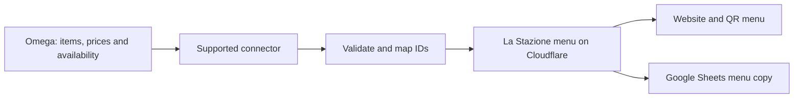

# La Stazione: Omega integration or a custom cashier system

Assessment date: 14 September 2026. Assumption: “Omega” means Omega Software / O-Live / Omega POS at omegapos.com, commonly used by restaurants in Lebanon. The installed product, version, license and hardware have not been inspected. This is a feasibility assessment, not an installed POS integration.

## Recommendation

Keep the existing website and its design. If the café already uses Omega successfully, first investigate a supported connection that copies its menu and availability into the website. Continue using Omega for sales and accounting. A linked Google Sheet should be a readable copy of that same menu, not a second competing price list.

Build a custom cashier application only if Omega cannot meet the café’s needs at an acceptable cost, and someone will own ongoing support. A café-specific system is feasible; matching the entire Omega product is a much larger undertaking.

## What the evidence establishes

| Finding | What it means for La Stazione |
| --- | --- |
| Omega advertises restaurant POS, modifiers, kitchen routing, stock, ordering and financial modules. | These are established product areas that would need replacing or consciously excluding in our own POS. [Omega restaurant platform](https://www.omegapos.com/restaurant) |
| Omega describes both cloud and offline operation for O-Live. | We must identify which installation the café actually has before designing a connector. [Omega O-Live](https://omegapos.com/fr/restaurant) |
| Deliverect documents a two-way Omega POS integration, including online orders and menu synchronization from the POS. | A supported integration route exists in some configurations. It does not establish unrestricted direct API access for our website or inclusion in the café’s subscription. [Deliverect–Omega integration](https://www.deliverect.com/en/integrations/omega-pos) |
| Omega’s store lists its Cloud POS + Back Office product at US$400 with an annual-license description. | This is a comparison reference, not a quote for La Stazione or its current edition. Confirm taxes, terminals, modules, setup, integration charges and local support separately. [Official product listing](https://store.omegapos.com/products/cloud-pos-bundle-for-restaurants-omega-software-hardware) |

I did not find a publicly accessible, sufficiently detailed direct Omega menu/order API contract in the material reviewed. That is an access/documentation gap, not proof that integration is impossible. No vendor has been contacted.

## Option A — Connect Omega to the existing website

Start with **menu synchronization**, without changing how the café takes payments. It is the smallest useful integration: update prices or availability once in the POS and have the QR menu follow.

Until a connector is approved, the existing owner editor remains the authoritative source. Once Omega becomes authoritative, price and availability editing in the owner page should be locked or clearly separated. Website descriptions, photos and presentation can remain locally managed. Avoid simultaneous automatic writes from Omega, Google Sheets and the owner page.

Potential connection methods, in preference order:

1. **Vendor-supported API or official connector.** Read stable product IDs, price variants, modifiers, categories and availability. Use webhooks if supported; otherwise poll at an agreed interval. Publish validated changes atomically, retain the last good menu on failure, and expose last-sync time to the owner.
2. **Approved integration platform.** Deliverect is evidence of an existing route; assess whether its supported channels make sense for a single café. Its integration page explicitly requires subscriptions to both Omega POS and Deliverect and lists Middle East support. Confirm the café’s exact edition and whether it can serve a custom menu website, rather than assuming this from delivery integrations. [Integration requirements](https://www.deliverect.com/en/integrations/omega-pos)
3. **Vendor-supported CSV export.** Import a scheduled or manually exported file with stable IDs and an owner review step. This is less immediate but can be sufficient for price updates.
4. **Local installation connector.** If the supported interface exists only on the café’s computer, run a small local service that makes outbound requests to Cloudflare. Do not expose the POS database to the internet or write directly into undocumented database tables.

Our menu already has stable IDs, two levels of categories, price variants, descriptions, item options and extras assigned to multiple categories/subcategories. A mapping table must connect those IDs to Omega’s IDs. Display names alone are not safe keys.

Online ordering is a separate second phase. It needs order acknowledgement, retry protection, duplicate prevention, menu-version checks, modifier validation, cancellation rules and a visible failure queue. A displayed menu is not currently an ordering or payment system.

## Information needed from Omega

These questions are ready to send to the café’s reseller or [Omega support](https://www.omegapos.com/contactus), but have **not** been sent:

- Which exact Omega product/version and cloud or local setup is installed? How many terminals and branches?
- Is there a supported API, SDK, connector or export for reading items, categories, price variants, modifiers and availability?
- Can you provide its documentation, authentication method, sandbox credentials, rate limits and integration pricing?
- Which system is allowed to change prices? Is third-party write access supported, and can images/descriptions remain website-managed?
- Are modifier minimum/maximum choices, required bread choices and price overrides represented in that interface?
- Are webhooks available? What happens when the internet or local server is unavailable?
- If we later add ordering: how are external IDs, duplicate submissions, acknowledgements, cancellations and payment references handled?
- Which printer, cash-drawer and payment-terminal models are installed, and who supports them?

## Option B — Build a La Stazione cashier system

The current menu, photo storage and owner authentication are useful foundations. They do not yet provide a transaction ledger, shifts, receipt numbering, payments, inventory or kitchen printing.

A sensible first release would cover one café and one primary cashier terminal:

| Area | Minimum practical behavior |
| --- | --- |
| Sale entry | Fast product search, category buttons, quantities, notes, sizes and extras; required/optional choices and selection limits. |
| Orders | Dine-in/takeaway, hold/recall, table or customer reference; controlled cancellation. |
| Money | USD and LBP tender, agreed change rules and exchange-rate snapshots; decimal/integer money arithmetic; preserve prices on completed sales. |
| Cash control | Opening float, cash in/out, closing count, expected vs actual totals, cashier shifts and manager-approved adjustments. |
| Receipts | Unique numbers, timestamp, itemization, clearly marked reprints, refunds/void records; confirm the café’s required receipt and accounting fields before launch. |
| Hardware | Test the actual receipt printer, kitchen/bar printers and drawer. Use an appropriate local printing service if browser printing cannot meet the workflow. |
| Offline operation | Durable local sales storage and an outbound sync queue; restart recovery, duplicate-safe synchronization, visible sync status and tested backups. |
| Permissions | Separate cashier and manager roles; record who applied discounts, voided or refunded a sale. Owner Google access alone is not a complete cashier permission model. |
| Reports | Sales by day/item/category/tender, shift reconciliation, void/refund totals and an accountant-friendly export. |

Keep card collection on a supported payment terminal/provider. The first release can record the payment method and terminal reference without collecting card details. Payment-terminal integration requires a separate supported contract and hardware test.

For a café that must keep selling through an internet outage, I would use a local application or local service with SQLite, plus Cloudflare synchronization and remote reporting. A public website or Google Sheet should not be the only place a completed sale exists. A multi-terminal local network needs additional coordination and testing; it is not automatically solved by making each browser work offline.

Later phases can add recipes, ingredient depletion, purchasing, stocktakes, loyalty, delivery, multi-branch reporting and accounting integration. Payroll and a full ERP are separate products in scope and maintenance burden.

## Effort and decision gates

These are rough planning ranges for a dedicated experienced engineer, not quotations or delivery promises:

| Scope | Planning range | Conditions |
| --- | --- | --- |
| Omega discovery and a read-only proof of connection | Several engineering days after access | Vendor documentation, test environment and representative menu available; vendor waiting time excluded. |
| Production menu connector | Roughly 1–3 engineering weeks | Clean, documented interface; stable IDs; menu mapping and failure handling tested. A local agent or poor exports can extend this. |
| Café-specific cashier MVP | Roughly 6–10 engineering weeks | One location, limited hardware, agreed cash/receipt rules, no full inventory or ERP. |
| Live pilot and hardening | At least 2–4 additional weeks | Real printer tests, offline/power-loss recovery, refunds, end-of-day reconciliation and staff feedback. |
| Broad Omega-like suite | Many months, potentially a year or more | Multiple modules, terminals, accounting, inventory and continuing support. |

“Free hosting” is not the total cost of a POS. Hardware, backup/recovery, support, maintenance, monitoring and staff training remain necessary. Choose the path based on the café’s operating needs and the actual vendor quote, not hosting price alone.

Before replacing the till, run a parallel pilot and reconcile every shift with the existing system. Test power loss during a sale, retry after a failed upload, duplicate clicks, printer failure, refunds, stale prices, multiple currencies and restoration from backup. Assign a named person to handle a failure during business hours.

**Next decision:** obtain the Omega product/version and its supported integration terms. If they are reasonable, connect the menu first. If they are not, scope the small cashier MVP with the actual café hardware before committing to replacement.
